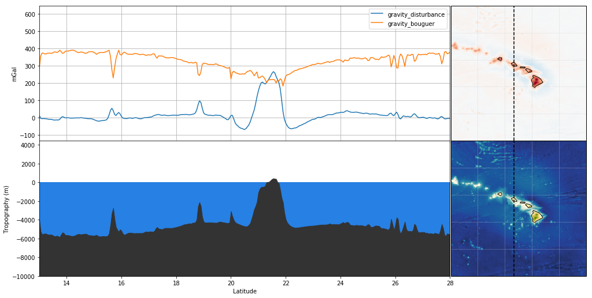

# Case studies: Gravity data from around the world

In this lesson, we'll explore the gravity data from a few different locations
and discuss what it can tell us about the isostatic state of the lithosphere.

**Run the notebooks online:** 

**View static versions of the notebooks:** 

## Concept

The lesson is designed for graduate and undergraduate students who have a
background in geology and geophysics and some knowledge of the theoretical
concepts of gravity anomalies and isostasy.
The overall goal is to introduce learners to real world examples and data that
illustrate the theoretical concepts that they have already acquired.
We'll do this by providing learners with data and the tools for exploring it
interactively.
The full lesson will take approximately 1.5 hours to complete.

## Learning objectives

* Reinforce theoretical concepts with real world examples
* Explore the relationship between plate tectonics, isostasy, and the gravity
* Visualize glacial isostatic rebound and flexure of the lithosphere at
  convergent margins and their effects on the Earth's gravity field

## Prerequisites

This lesson assumes basic knowledge of:

* The layering of the Earth (crust, mantle, core, lithosphere, asthanosphere)
  <[Wikipedia](https://en.wikipedia.org/wiki/Structure_of_the_Earth)>
  <[SEG wiki](https://wiki.seg.org/wiki/Layers_of_the_Earth)>
* The Earth gravity field (gravitational and rotational components) and Normal
  gravity
* The gravity disturbance
* The gravitational effect of topography and the Bouguer correction
* Isostasy (Airy–Heiskanen, Pratt-Hayford, and Vening Meinesz models) and it's
  relationship with the topography-free gravity disturbance

## Further reading

Where to go when you're done with this lesson.

## Data

Describe the data we'll use.

## The software

Describe the software.

How to run things online.

Install instructions to run things locally.

## For teachers

Where to find the lesson plan. How long this lesson will take.
[LESSON_PLAN.md](LESSON_PLAN.md).

## Getting Help and Contributing

Please read our [Contributing Guide](CONTRIBUTING.md) to see how you can request
help, contribute to this lesson, and give feedback.

This project is released with a [Code of Conduct](CODE_OF_CONDUCT.md). By
participating in this project you agree to abide by its terms.

### Imposter syndrome disclaimer

**We want your help.** No, really.

There may be a little voice inside your head that is telling you that you're
not ready to be a contributor; that your skills aren't nearly good enough to
contribute. What could you possibly offer?

We assure you that the little voice in your head is wrong.

**Being a contributor doesn't just mean writing code or extensive prose**.
Equality important contributions include: fixing typos and misspelled words,
suggesting or implementing small changes, or even giving feedback about the
project (including giving feedback about the contribution process). If you're
coming to the project with fresh eyes, you might see the errors and assumptions
that seasoned contributors have glossed over. If you can write any code at all,
you can contribute code to open source projects. We are constantly trying out
new skills, making mistakes, and learning from those mistakes. That's how we
all improve and we are happy to help others learn.

## License

You are free to reuse, share, and modify the contents of this lesson under the
terms of the Creative Commons Attribution 4.0 license and the BSD-3-clause
license (see [LICENSE.md](LICENSE.md) for details).
